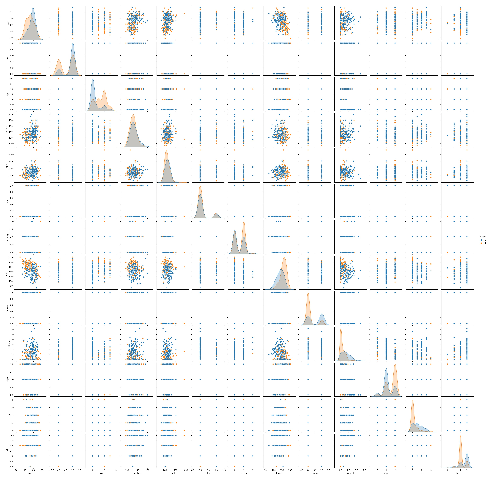

```{r, setup, include=FALSE}
library(ISLR)
library(dplyr)
library(ggplot2)
reticulate::use_condaenv(condaenv = "r-test", required = TRUE)
```


## Data clean and Descriptive Statistics

The dataset contains 303 rows/observations and 14 variables in total. 
```{r}
heart_ <- read.csv("heart.csv")

dim(heart_)
head(heart_)
```
```{r}
summary(heart_)
```

For the follow analysis, some algorithms require the categorical variables to be in the form of factor. This step convert those categorical variables into factors. Since the dataset is pre-processed, there is not missing value.

```{r}
# convert categorical variables into factors: sex, cp, fbs, restecg, exang, slope, ca, thal, target
heart_data <- heart_ %>% 
  mutate(target = as.factor(target)) %>%
  mutate(sex = as.factor(sex)) %>%
  mutate(cp = as.factor(cp)) %>%
  mutate(fbs = as.factor(fbs)) %>%
  mutate(restecg = as.factor(restecg)) %>%
  mutate(exang = as.factor(exang)) %>%
  mutate(slope = as.factor(slope)) %>%
  mutate(ca = as.factor(ca)) %>%
  mutate(thal = as.factor(thal))
sum(is.na(heart_data))
  
```

## EDA -- visualization:

(a) heatmap for the correlation matrix
```{r, message=F, warning=F}
library(gplots)
library(RColorBrewer)

cor_mat <- cor(heart_)

# display.brewer.pal(10, "BrBG")
palettte_ <- brewer.pal(10, "BrBG")
color_ <- colorRampPalette(palettte_)(20)

text_ <- format(round(cor_mat, 2))

heatmap.2(cor_mat,
    trace="none",
    col=color_, 
    density.info = "none", 
    key.xlab ='Correlation',
    key.title = "",
    cexRow = 1, cexCol = 1, 
    Rowv = F, Colv = F, 
    margins = c(5, 5),
    cellnote = text_,
    notecol='black'
 )


```

(b) pairplot in a glance

```{r, vis_prepare, eval=F}

library("reticulate")
python_exe_path <- "/Users/missshihonghowru/anaconda3/envs/r-test/bin/python"
use_python(python_exe_path) 

sns <- import('seaborn')
plt <- import('matplotlib.pyplot')
pd <- import('pandas')

```

```{r, eval=F}
sns$pairplot(r_to_py(heart_data), hue = 'target')
#display the plot
plt$savefig('pairplot.jpg')
```


Output image:




(c) Barplots for categorical variables vs. target

```{r, cat_vis}
library(gridExtra)

# sex, cp, fbs, restecg, exang, slope, ca, thal
p1 <- ggplot(heart_data, aes(x = target, fill = sex)) + 
      geom_bar(position = "dodge") + theme_bw() + labs(y="sex")
p2 <- ggplot(heart_data, aes(x = target, fill = cp)) + 
      geom_bar(position = "dodge") + theme_bw() + labs(y="cp")
p3 <- ggplot(heart_data, aes(x = target, fill = fbs)) + 
      geom_bar(position = "dodge") + theme_bw() + labs(y="fbs")
p4 <- ggplot(heart_data, aes(x = target, fill = restecg)) + 
      geom_bar(position = "dodge") + theme_bw() + labs(y="restecg")
p5 <- ggplot(heart_data, aes(x = target, fill = exang)) + 
      geom_bar(position = "dodge") + theme_bw() + labs(y="exang")
p6 <- ggplot(heart_data, aes(x = target, fill = slope)) + 
      geom_bar(position = "dodge") + theme_bw() + labs(y="slope")
p7 <- ggplot(heart_data, aes(x = target, fill = ca)) + 
      geom_bar(position = "dodge") + theme_bw() + labs(y="ca")
p8 <- ggplot(heart_data, aes(x = target, fill = thal)) + 
      geom_bar(position = "dodge") + theme_bw() + labs(y="thal")

grid.arrange(p1, p2, p3, p4, p5, p6, p7, p8, nrow=3, ncol = 3)

```

(d) Boxplots for continuous variables vs. target

```{r, con_vis}
# age, trestbps, chol, thalach, oldpeak
box1 <- ggplot(heart_data, aes(x = target, y = age, fill = target)) + 
  geom_boxplot() + 
  geom_jitter(width = .04, alpha = .2) + 
  guides(fill = "none") + theme_bw()
box2 <-ggplot(heart_data, aes(x = target, y = trestbps, fill = target)) + 
  geom_boxplot() + 
  geom_jitter(width = .04, alpha = .2) + 
  guides(fill = "none") + theme_bw()
box3 <-ggplot(heart_data, aes(x = target, y = chol, fill = target)) + 
  geom_boxplot() + 
  geom_jitter(width = .04, alpha = .2) + 
  guides(fill = "none") + theme_bw()
box4 <- ggplot(heart_data, aes(x = target, y = thalach, fill = target)) + 
  geom_boxplot() + 
  geom_jitter(width = .04, alpha = .2) + 
  guides(fill = "none") + theme_bw()
box5 <- ggplot(heart_data, aes(x = target, y = oldpeak, fill = target)) + 
  geom_boxplot() + 
  geom_jitter(width = .04, alpha = .2) + 
  guides(fill = "none") + theme_bw()
grid.arrange(box1,box2,box3,box4,box5, nrow=2, ncol = 3)

```

## Data preprocess

In this step, we randomly divide our dataset into train and test set following a partition ratio of 5:1. Since the dataset contains 303 observations in total, the number of observations in the train and test set would roughly be 250 and 53, respectively.

```{r, preprocess}

# train - test split
set.seed(64)
n_obs <- dim(heart_data)[1]
train_idx <- sample(n_obs, 250)
# val_idx <- sample(seq(n_obs)[-train_idx], 50)
test_idx <- seq(n_obs)[-train_idx]

```


In the following 2 parts, we will train a model with the parameters being selected based on cross-validation performances for each algorithm. Then in the last part, we will report the training and testing accuracy for each of those models, and select the best single model based on the testing accuracy. 

## Algorithm - Tree-based Approaches 

```{r, message=FALSE}
library(ISLR)
library(leaps)
set.seed(64)
Y <- heart_data$target
X <- heart_data[, 1:13]

train_data <- heart_data[train_idx, ]
test_data <- heart_data[test_idx, ]

```

### (a) Decision Tree (classification tree)

First, we fit a single tree using all variables, which grows into 19 leafs.
```{r, message=FALSE}
set.seed(64)
library(tree)
# attach(heart_data)
Cl_tree <- tree(target ~ ., data = train_data)
summary(Cl_tree)

## 19 terminal nodes
## training error rate :0.116
plot(Cl_tree)
text(Cl_tree, pretty=0)
```

```{r}
##prediction on testing set
set.seed(64)
Cl_pred = predict(Cl_tree, test_data, type="class")
# table(test_data$target, Cl_pred)

## testing set accuracy :0.755
round(mean(Cl_pred == Y[test_idx]), 3)    
```

Next, we prune the tree using cross validation.
```{r}
##Cross-validation 
set.seed(64)
cv_Cl_tree <- cv.tree(Cl_tree, FUN=prune.misclass)
cv_Cl_tree$size
cv_Cl_tree$dev
```

Size of 11, 9, and 6 give lowest cross-validation errors. We choose the smallest size, which is 6.

```{r}
## new classification tree: prune_Cl_tree
## Prediction on testing data
set.seed(64)
prune_Cl_tree <- prune.misclass(Cl_tree, best = 6)
plot(prune_Cl_tree)
text(prune_Cl_tree, pretty = 0)
prune_Cl_pred.test <- predict(prune_Cl_tree, test_data, type="class")
## new testing set accuracy :0.83
#table(test_data$target, prune_Cl_pred.test)
acc.test.dt <- round(mean(Y[test_idx] == prune_Cl_pred.test), 3)

prune_Cl_pred.tr <- predict(prune_Cl_tree, train_data, type="class")
## new training set accuracy :0.852
#table(train_data$target, prune_Cl_pred.tr)
acc.tr.dt <- round(mean(Y[train_idx] == prune_Cl_pred.tr), 3)

```

### (b) Random Forest

In random forests, due to the availiblity of the out-of-bag samples, there is no need for cross-validation or a separate validation set to get an unbiased estimate of the validation set error. 

```{r, message=FALSE}
set.seed(64)
require(randomForest)

## mtry = sqrt(p) is a canonical choice for classification
p <- 13
rf_heart <- randomForest(target ~ ., data = train_data, mtry = sqrt(p), importance = TRUE)
rf_heart
## OOB estimate of Error rate: 17.6%
```


```{r}
## Prediction on testing set
set.seed(64)
yhat_rf_heart <- predict(rf_heart, newdata = test_data)
importance(rf_heart)
varImpPlot(rf_heart)
#table(test_data$target, yhat_rf_heart)

## testing set accuracy : 0.792
round(mean(Y[test_idx] == yhat_rf_heart), 3)  
```

Neither of Mean Decrease in Accuracy and Mean Decrease in Gini (index) are bulletproof metrics and they may suffer when comparing numeric and categorical variables, or comparing numeric variables if the scales are vastly different. We cannot compare them directly.
Here we would follow up all the variables except `fbs` and `restecg` since they performed poorly in both measures.
```{r}
set.seed(64)
rf_heart_new <- randomForest(target ~ age + sex + cp + trestbps + chol + thalach 
                             + exang + oldpeak + slope + ca + thal, 
                             data = train_data, mtry = sqrt(p), importance = TRUE)
rf_heart_new
## OOB estimate of Error rate: 17.6%
```


```{r}
set.seed(64)
## New prediction on testing set
yhat_rf_heart.test <- predict(rf_heart_new, newdata = test_data)
#table(test_data$target, yhat_rf_heart.test)
acc.test.rf = round(mean(Y[test_idx] == yhat_rf_heart.test), 3) 

## New prediction on training set
yhat_rf_heart.tr <- predict(rf_heart_new, newdata = train_data)
#table(train_data$target, yhat_rf_heart.tr)
acc.tr.rf = round(mean(Y[train_idx] == yhat_rf_heart.tr), 3) 
## training set accuracy : 1
## testing set accuracy : 0.811
```

New random forest model performs better on testing data.

### (c) Gradient Boosting

```{r}
## Rstudio crashes when classification response was set to factor.
## I create a new gbm_heart_data to solve this problem
set.seed(64)
gbm_heart_data <- heart_data %>% 
  mutate(target = ifelse(target == 1, 1, 0))

gbm_train_data <- gbm_heart_data[train_idx, ]
gbm_test_data <- gbm_heart_data[test_idx, ]
```

```{r, message=FALSE}
set.seed(64)
library(gbm)

gbm_heart <- gbm(target ~ ., data = gbm_train_data, distribution = "bernoulli",
                 n.trees = 5000, shrinkage = 0.01, cv.folds = 5, n.minobsinnode = 5)

print(gbm_heart)
summary(gbm_heart)
## Determine the optimal number of iterations by cross-validation: 760
gbm_heart_iter <- gbm.perf(gbm_heart, plot.it = TRUE, method = "cv")
```

We can see that `ca` and `cp` are the most important variables for this model. The validation deviance stops to decrease at 760-th iteration. Next, let's try to exclude least important variables `fbs`, `restecg`, `age`, `sex` and `chol`. 
```{r}
set.seed(64)
gbm.1 <- gbm(target ~ .-fbs - restecg -age -sex -chol, data = gbm_train_data,
             distribution = "bernoulli", n.trees = 1000, 
             shrinkage = 0.01, cv.folds = 5, n.minobsinnode = 5)

print(gbm.1)
summary(gbm.1)
## Determine the optimal number of iterations by cross-validation: 693
gbm_heart_iter <- gbm.perf(gbm.1, plot.it = TRUE, method = "cv")
```

```{r}

## Prediction on training data
yhat_gbm_heart.tr <- predict(gbm_heart, newdata = gbm_train_data, n.trees = gbm_heart_iter)
# Prediction on testing data
yhat_gbm_heart.test <- predict(gbm_heart, newdata = gbm_test_data, n.trees = gbm_heart_iter)
```

In this step, we plot the ROC curve on the training set to get the best critical value for the maximum accuracy.

```{r, message=FALSE}
## Plot the ROC curve to get the best critical value for the maximum accuracy
## the selection of the best critical value should based on training set
library(stats)
library(pROC)
heart_roc <- roc(gbm_train_data$target, yhat_gbm_heart.tr)
plot(heart_roc)
# Area under the curve: 0.9

##Call the optimal threshold
##Use this threshold to get the corresponding prediction category
roc_threshold <- unlist(coords(heart_roc, "best")["threshold"])
```

```{r}

## Calculate Accuracy
## Training set accuracy: 0.884
yhat_gbm_heart_class.tr <- ifelse(yhat_gbm_heart.tr > roc_threshold, 1, 0)
acc.tr.gbm = round(mean(gbm_train_data$target== yhat_gbm_heart_class.tr), 3)
#table(gbm_train_data$target, yhat_gbm_heart_class.tr)


## Testing set accuracy: 0.774
yhat_gbm_heart_class.test <- ifelse(yhat_gbm_heart.test > roc_threshold, 1, 0)
acc.test.gbm = round(mean(gbm_test_data$target== yhat_gbm_heart_class.test), 3)
#table(gbm_test_data$target, yhat_gbm_heart_class.test)
```


### (d) Extreme Gradient Boosting

```{r, message=FALSE}
##XGBoost only works with matrices that contain all numeric variables, so we use heart_ dataset
set.seed(64)
require(xgboost)

xgb_train_data <- heart_[train_idx, ]
xgb_test_data <- heart_[test_idx, ]

##isolate y variable
xgb_train_y <- xgb_train_data$target
xgb_test_y <- xgb_test_data$target

## isolate x variables
xgb_train_x <- data.matrix(xgb_train_data[,1:13])
xgb_test_x <- data.matrix(xgb_test_data[,1:13])
```

```{r}
## train a model using training data
set.seed(64)
## create parameter list
params <- list(eta = 0.1,
               max_depth = 6, 
               subsample = 0.8,
               colsample_bytree = 0.9,
               min_child_weight = 1,
               gamma = 0,
               objective = "binary:logistic",
               booster = "gbtree",
               eval_metric = "auc")

xgb_heart <- xgb.cv(params = params,
                    data = xgb_train_x,
                    label = xgb_train_y,
                    nrounds = 2000,
                    nfold = 5,
                    verbose = 0)

max_test <- which.max(xgb_heart$evaluation_log$test_auc_mean)

## train final model
xgb_heart_final <- xgboost(params = params,
                           data = xgb_train_x,
                           label = xgb_train_y,
                           nrounds = max_test,
                           verbose = 0)
```


```{r}
##create importance matrix
importance_matrix <- xgb.importance(model = xgb_heart_final)

# variable importance plot
xgb.plot.importance(importance_matrix, top_n = 10, measure = "Gain")
```

We can see that `ca` and `cp` are the 2 most important variables in this model.

```{r}

##evaluate model: train
xgb_heart_pred.tr <- predict(xgb_heart_final, newdata = xgb_train_x)
xgb_heart_pred.tr <- ifelse(xgb_heart_pred.tr > 0.5, 1,0)

#table(xgb_heart_pred.tr, xgb_train_y)
##check the accuracy on training data: 0.984

acc.tr.xgb <- round(mean(xgb_heart_pred.tr == xgb_train_y), 3)


##evaluate model: test
xgb_heart_pred.test <- predict(xgb_heart_final, newdata = xgb_test_x)
xgb_heart_pred.test <- ifelse(xgb_heart_pred.test > 0.5, 1,0)

#table(xgb_heart_pred.test, xgb_test_y)
##check the accuracy on testing data: 0.774

acc.test.xgb <- round(mean(xgb_heart_pred.test == xgb_test_y), 3)

#require(caret)
#confusionMatrix(table(xgb_heart_pred.test, xgb_test_y))

```

## Algorithm - Other Approaches 

For the rest of the algorithms, KNN, SVM, and NN require the input variables to be standardized.

```{r, standardize, message=FALSE}

library(ISLR)
library(leaps)
set.seed(64)

# standardize 
# numeric_vars <- c("age", "trestbps", "chol", "thalach", "oldpeak")
attach(heart_data)
heart_data$age <- (age - mean(age))/sd(age)
heart_data$trestbps <- (trestbps - mean(trestbps))/sd(trestbps)
heart_data$chol <- (chol - mean(chol))/sd(chol)
heart_data$thalach <- (thalach - mean(thalach))/sd(thalach)
heart_data$oldpeak <- (oldpeak - mean(oldpeak))/sd(oldpeak)
detach(heart_data)

Y <- heart_data$target
X <- heart_data[, 1:13]
train_data <- heart_data[train_idx, ]
test_data <- heart_data[test_idx, ]

```

### (a) Logsitic Regression

Let's first define a function for calculating accuracy. It intakes the fitted model, and output the training accuracy and the testing accuracy. 

```{r, acc_cal.lr}
cal_acc <- function(mod_name) {
  probs <- predict(mod_name, train_data, type = "response")
  pred = rep(0, length(probs))
  pred[probs > 0.5] = 1
  probs.test <- predict(mod_name, test_data, type = "response")
  pred.test = rep(0, length(probs.test))
  pred.test[probs.test > 0.5] = 1
  acc.tr <- round(mean(pred == Y[train_idx]), 3)
  acc.test <- round(mean(pred.test == Y[test_idx]), 3)
  return(c(acc.tr, acc.test))
}
  
```

```{r, LR.full, message=FALSE}

library(boot)
set.seed(64)
lr.fit.full = glm(target ~ ., data = train_data, family = binomial)
cv.glm(train_data, lr.fit.full, K=5)$delta[1]
```

We try to allievate the overfitting issue by subsetting some important predictors using backward stepwise strategy. 
The 'cp' indicator suggests a 12-variables model as the best choice, while the 'bic' indicator suggests a 8-variables model.

```{r, subset.lr}

lr.bwd = regsubsets(target ~ ., data = train_data, nvmax = 20, method = "backward")
bwd.summary = summary(lr.bwd)
which.min(bwd.summary$cp)
which.min(bwd.summary$bic)
coefficients(lr.bwd, id = 12)
coefficients(lr.bwd, id = 8)
```

We will now try each of them: 

```{r, LR.bic}
set.seed(64)
lr.fit.bic = glm(target ~ cp+exang+oldpeak+slope+ca+thal, data = train_data, family = binomial)
err.bic <- cv.glm(train_data, lr.fit.bic, K=5)$delta[1]
err.bic
# cal_acc(lr.fit.bic)
```

```{r, LR.cp}
set.seed(64)
lr.fit.cp = glm(target ~ sex+cp+chol+restecg+thalach+exang+oldpeak+slope+ca+thal, data = train_data, family = binomial)
err.cp <- cv.glm(train_data, lr.fit.cp, K=5)$delta[1]
err.cp
# cal_acc(lr.fit.cp)
```

Based on the cross-validation error rate, the 6-variables model suggested by "bic" indictor over-perform other models.

```{r}
acc.lr <- cal_acc(lr.fit.bic)
acc.tr.lr <- acc.lr[1]
acc.test.lr <- acc.lr[2]
```

### (b) Linear Discriminant Analysis

```{r, acc_cal.lda, message=FALSE}
library(MASS)

acc_cal.lda <- function(mod_name) {
  
  pred <- predict(mod_name, train_data)$class
  pred.test <- predict(mod_name, test_data)$class
  acc.tr <- round(mean(pred == Y[train_idx]), 3)
  acc.test <- round(mean(pred.test == Y[test_idx]), 3)
  return(c(acc.tr, acc.test))
}

```

For the following algorithms, we would use the self-implemented 5-folds cross-validation based on this division.

```{r, kfolds, message=F}
library(caret)
set.seed(64)
folds = createFolds(Y[train_idx], k = 5)
```

Firstly, define a function for doing cross-validation.

```{r, lda.func}

cv_lda <- function(test.id, formula_) {
  training_fold = train_data[-test.id, ]
  test_fold = train_data[test.id, ]
  
  lda.fit = lda(formula_, data=training_fold)
  lda.pred <- predict(lda.fit, test_fold)$class
  accuracy = round(mean(test_fold[, 14] == lda.pred), 3)
  
  return(accuracy)
}


```

Next, we evaluate cross-validation error rate based on the following 3 combinations of predictors. These 3 combinations are the two combinations suggested by stepwise selection, and all variables respectively.

```{r}
allVars <- colnames(train_data)
predictorVars <- allVars[!allVars%in%'target']
predictorVars <- paste(predictorVars, collapse = "+")
f.full <- as.formula(paste("target~", predictorVars, collapse = "+"))
acc.full <- lapply(folds, cv_lda, f.full)
acc.full <- mean(as.numeric(acc.full))
acc.full # 0.844

predictorVars_cp <- c("sex", "cp", "chol", "restecg", "thalach", "exang", "oldpeak", "slope", "ca", "thal")
predictorVars_cp <- paste(predictorVars_cp, collapse = "+")
f.cp <- as.formula(paste("target~", predictorVars_cp, collapse = "+"))
acc.cp <- lapply(folds, cv_lda, f.cp)
acc.cp <- mean(as.numeric(acc.cp))
acc.cp  # 0.852

predictorVars_bic <- c("cp", "exang", "oldpeak", "slope", "ca", "thal")
predictorVars_bic <- paste(predictorVars_bic, collapse = "+")
f.bic <- as.formula(paste("target~", predictorVars_bic, collapse = "+"))
acc.bic <- lapply(folds, cv_lda, f.bic)
acc.bic <- mean(as.numeric(acc.bic))
acc.bic  # 0.84

```
Based on the cross-validation accuracy, the second lda model containing 10 predictors has the best performance. Thus, we select this model as the final lda model. Next we evaluate the training and testing accuracy of this model.

```{r}
lda.fit <- lda(f.cp, train_data)
acc.lda <- acc_cal.lda(lda.fit)
acc.tr.lda <- acc.lda[1]
acc.test.lda <- acc.lda[2]

```


### (c) K-Nearest Neighbors Classifier

In order to select the parameter *k* for KNN, we first define a function for cross-validation.

```{r, cv.func.knn}

cv_knn <- function(test.id, k = 3) {
  training_fold = train_data[-test.id, ]
  test_fold = train_data[test.id, ]
  knn.pred = knn(training_fold[, 1:13], test_fold[1:13], training_fold[, 14], k=k)
  accuracy = round(mean(test_fold[, 14] == knn.pred), 3)
  return(accuracy)
}

```

Next step is selecting *k*

```{r, message=FALSE}

library(class)
set.seed(64)

k_vec <- seq(1, 19, 2)
knn.acc.cv <- rep(0, length(k_vec))
for (i in 1:length(k_vec)) {
  ki <- k_vec[i]
  acc.knn <- lapply(folds, cv_knn, ki)
  knn.acc.cv[i] <- mean(as.numeric(acc.knn))
}
tibble(k = k_vec, acc.CV = knn.acc.cv)

```

When k=5, the knn yields the highest cross-validation accuracy (0.820)

```{r}
knn.pred.tr = knn(X[train_idx, ], X[train_idx, ], Y[train_idx], k=5)
acc.tr.knn <- round(mean(knn.pred.tr == Y[train_idx]), 3)  # train.accuracy 
knn.pred.test = knn(X[train_idx, ], X[test_idx, ], Y[train_idx], k=5)
acc.test.knn <- round(mean(knn.pred.test == Y[test_idx]), 3) # test.accuracy 
```


### (d) Support Vector Machine

```{r, message=FALSE}
set.seed(64)
library(e1071)

cal_acc.svm <- function(svm.fit) {
  svm.pred = predict(svm.fit, train_data)
  acc.tr <- round(mean(svm.pred == Y[train_idx]), 3)
  svm.pred.test = predict(svm.fit, test_data)
  acc.test <- round(mean(svm.pred.test== Y[test_idx]), 3)
  return(c(acc.tr, acc.test))
}

```

In order to select parameter combinations for SVM, we first define a function for cross-validation.

```{r, cv.func.svm}

cv_svm <- function(test.id, gamma=1, cost=1) {
  training_fold = train_data[-test.id, ] # training fold =  training set minus (-) it's sub test fold
  test_fold = train_data[test.id, ] # here we describe the test fold individually
  classifier = svm(target ~ ., data = training_fold, gamma = gamma, cost = cost, kernel="radial")
  y_pred = predict(classifier, newdata = test_fold)
  accuracy = round(mean(test_fold[, 14] == y_pred), 3)
  return(accuracy)
}

```

Then, we search for an appropriate range of gamma value throught 5-folds cross-validation.

```{r}
search_area.gamma <- c(0.01, 0.02, 0.05, 0.1, 0.2, 0.5, 1, 2, 10)
vec.acc.cv <- rep(0, length(search_area.gamma))

for (i in 1:length(search_area.gamma)) {
  gamma <- search_area.gamma[i]
  acc <- lapply(folds, cv_svm, gamma)
  vec.acc.cv[i] <- mean(as.numeric(acc))
}
gamma_acc <- tibble(gamma = search_area.gamma, acc.CV = vec.acc.cv)
gamma_acc
```

It seems like 0.01 ~ 0.5 is the appropriate range for the value of gamma. The next step is to search for a good value of "cost", trying to alleviate overfitting. 

```{r}
set.seed(64)
search_area.cost <- c( 0.001, 0.005, 0.01, 0.1, 1, 10, 100, 1000)

results_table.svm <- tibble(cost = search_area.cost)
for (gamma in c(0.01, 0.02, 0.05, 0.1, 0.2, 0.5)) {
  vec.acc.cv <- rep(0, length(search_area.cost))
  for (i in 1:length(search_area.cost)) {
    cost <- search_area.cost[i]
    acc <- lapply(folds, cv_svm, gamma, cost)
    vec.acc.cv[i] <- mean(as.numeric(acc))
  }
  results_table.svm <- cbind(results_table.svm, vec.acc.cv)
}
colnames(results_table.svm) <- c('cost', 'gamma0.01','gamma0.02','gamma0.05', 'gamma0.1', 'gamma0.2', 'gamma0.5')
results_table.svm
```

When gamma = 0.01; cost = 100, svm yields the best cross-validation accurarcy: 0.844.

```{r}
svm.fit.best = svm(target ~ ., data = train_data, gamma = 0.01, cost = 100)
acc.svm = cal_acc.svm(svm.fit.best)
acc.tr.svm <- acc.svm[1]
acc.test.svm <- acc.svm[2]
```

### (e) Neural Networks
```{r, message=F}
library(grid)
library(neuralnet)

# preprocess for NN:
data.nn <- data.frame(scale(heart_[, 1:13]))
data.nn$target <- heart_[, 14]

train_data.nn <- data.nn[train_idx, ]
test_data.nn <- data.nn[test_idx, ]
```

Similarily, the first step is to define a function for doing cross-validation.

```{r, cv.func.nn}

cv_nn <- function(test.id, hidden_layer=c(5, 3), lr=0.01) {
  training_fold = train_data.nn[-test.id, ]
  test_fold = train_data.nn[test.id, ]
  
  allVars <- colnames(data.nn)
  predictorVars <- allVars[!allVars%in%'target']
  predictorVars <- paste(predictorVars, collapse = "+")
  f <- as.formula(paste("target~", predictorVars, collapse = "+"))
  net.fit <- neuralnet(f, training_fold, hidden= hidden_layer, learningrate = lr, 
                       act.fct = "logistic", linear.output=F)
  probs.nn <- compute(net.fit, test_fold[, 1:13])
  pred.nn <- rep(0, length(test.id))
  pred.nn[probs.nn$net.result > 0.5] = 1 
  accuracy <- round(mean(pred.nn == test_fold[, 14]), 3)
  return(accuracy)
}

```

Since the dataset has a small sample size, training a neural network won't take long. Thus, I decide to search for a good combination of hidden layers and the learning rate through cross-validation.

```{r}
set.seed(64)

hidden_1 <- 3:8
hidden_2 <- 2:3
learning_rates <- c(0.001, 0.005, 0.01, 0.05, 0.1)

# acc.cv <- rep(0, length(hidden_2))
results_table.nn <- tibble(h1 = hidden_1)
for (lr in learning_rates) {
  results_table_lr <- tibble(h1 = hidden_1)
  for (h2 in hidden_2) {
    acc.cv <- c()
    for (h1 in hidden_1) {
      hidden_layers <- c(h1, h2)
      acc <- lapply(folds, cv_nn, hidden_layers, lr)
      acc.cv <- c(acc.cv, mean(as.numeric(acc)))
    }
    results_table_lr <- cbind(results_table_lr, acc.cv)
  }
  colnames(results_table_lr) <- paste(c("h1", "h2-2", "h2-3"), lr, sep="-")
  results_table.nn <- cbind(results_table.nn, results_table_lr[, 2:3])
}
results_table.nn
```

When we have 2 hidden layers with the number of neurons in each layer being 4 and 3, and learning rate = 0.05, the neural netwrok yields best cross-validation accuracy (0.848).

```{r}
set.seed(64)

allVars <- colnames(data.nn)
predictorVars <- allVars[!allVars%in%'target']
predictorVars <- paste(predictorVars, collapse = "+")
f <- as.formula(paste("target~", predictorVars, collapse = "+"))
net.best <- neuralnet(f, train_data.nn, hidden= c(4, 3), learningrate = 0.05, 
                      act.fct = "logistic", linear.output=F)
plot(net.best)
# train acc
probs.nn <- compute(net.best, train_data.nn[, 1:13])
pred.nn.tr <- rep(0, length(train_idx))
pred.nn.tr[probs.nn$net.result > 0.5] = 1 
acc.tr.nn <- round(mean(pred.nn.tr == Y[train_idx]), 3)

# test acc
probs.nn.test <- compute(net.best, test_data.nn[, 1:13])
pred.nn.test <- rep(0, length(test_idx))
pred.nn.test[probs.nn.test$net.result > 0.5] = 1 
acc.test.nn <- round(mean(pred.nn.test == Y[test_idx]), 3)

acc.tr.nn
acc.test.nn
```


## Model Selection

### Selection of best Single Model

```{r}

train_accuracy =c(acc.tr.dt, acc.tr.rf, acc.tr.gbm, acc.tr.xgb, 
                  acc.tr.lr, acc.tr.lda, acc.tr.knn, acc.tr.svm, acc.tr.nn)
test_accuracy = c(acc.test.dt, acc.test.rf, acc.test.gbm, acc.test.xgb, 
                  acc.test.lr, acc.test.lda, acc.test.knn, acc.test.svm, acc.test.nn)


ACC <- tibble(accuracy=c(train_accuracy, test_accuracy), 
              algo=rep(c('DT', 'RF','GBM','XGB',
                         'LR', 'LDA', 'KNN', 'SVM', 'NN'), 2), 
              phase=factor(rep(c('train', 'test'), each=9))
              )


ggplot(ACC, aes(algo, accuracy)) +   
  geom_bar(aes(fill = phase), position = "dodge", stat="identity", alpha=0.9) +
  geom_text(aes(label=accuracy), vjust=1.6, hjust = rep(c(-0.4, 1.2), each=9), color="white", size=2) +
  theme_bw() +
  labs(x="")
  
```

From the histogram, we observe that the DT model has the highest test accuracy(0.83), while other more complex models suffer from severe overfitting issue although they have higher training accuracy. 


# Model Ensemble 

First Step get predictions of each algorithm for both training and testing set. 
```{r}
# lr.fit.bic
probs <- predict(lr.fit.bic, train_data, type = "response")
pred.tr.lr = rep(0, length(probs))
pred.tr.lr[probs > 0.5] = 1
probs.test <- predict(lr.fit.bic, test_data, type = "response")
pred.test.lr = rep(0, length(probs.test))
pred.test.lr[probs.test > 0.5] = 1

# lda.fit.best
lda.pred.tr <- predict(lda.fit, train_data)$class
lda.pred.test <- predict(lda.fit, test_data)$class

# svm.fit.best
svm.pred.tr = predict(svm.fit.best, train_data)
svm.pred.test = predict(svm.fit.best, test_data)

```

```{r}

# convert all factors into numeric
prune_Cl_pred.test = ifelse(prune_Cl_pred.test == 1, 1, 0)
prune_Cl_pred.tr = ifelse(prune_Cl_pred.tr == 1, 1, 0)
yhat_rf_heart.test = ifelse(yhat_rf_heart.test == 1, 1, 0)
yhat_rf_heart.tr = ifelse(yhat_rf_heart.tr == 1, 1, 0)
yhat_gbm_heart_class.test = ifelse(yhat_gbm_heart_class.test == 1, 1, 0)
yhat_gbm_heart_class.tr = ifelse(yhat_gbm_heart_class.tr == 1, 1, 0)
xgb_heart_pred.test = ifelse(xgb_heart_pred.test == 1, 1, 0)
xgb_heart_pred.tr = ifelse(xgb_heart_pred.tr == 1, 1, 0)
pred.tr.lr = ifelse(pred.tr.lr == 1, 1, 0)
pred.test.lr = ifelse(pred.test.lr == 1, 1, 0)
lda.pred.tr = ifelse(lda.pred.tr == 1, 1, 0)
lda.pred.test = ifelse(lda.pred.test == 1, 1, 0)
knn.pred.tr = ifelse(knn.pred.tr == 1, 1, 0)
knn.pred.test = ifelse(knn.pred.test == 1, 1, 0)
svm.pred.tr = ifelse(svm.pred.tr == 1, 1, 0)
svm.pred.test = ifelse(svm.pred.test == 1, 1, 0)
pred.nn.tr = ifelse(pred.nn.tr == 1, 1, 0)
pred.nn.test = ifelse(pred.nn.test == 1, 1, 0)

train_prediction <- cbind(dt = prune_Cl_pred.tr, rf = yhat_rf_heart.tr, 
                          gbm = yhat_gbm_heart_class.tr, xgb=xgb_heart_pred.tr,
                          lr = pred.tr.lr, lda = lda.pred.tr,
                          knn = knn.pred.tr, svm = svm.pred.tr, nn = pred.nn.tr)


# define a function for finding the majority class
getmode <- function(v) {
   uniqv <- unique(v)
   uniqv[which.max(tabulate(match(v, uniqv)))]
}
bagged_pred.tr <- rep(0, length(train_idx))
for (i.row in 1:dim(train_prediction)[1]) {
  i.pred <- getmode(train_prediction[i.row, ])
  bagged_pred.tr[i.row] = i.pred
}
round(mean(bagged_pred.tr == Y[train_idx]), 3)

test_prediction <- cbind(dt = prune_Cl_pred.test, rf = yhat_rf_heart.test, 
                         gbm = yhat_gbm_heart_class.test, xgb=xgb_heart_pred.test,
                         lr = pred.test.lr, lda = lda.pred.test,
                         knn = knn.pred.test, svm = svm.pred.test, nn = pred.nn.test)
bagged_pred.test <- rep(0, length(test_idx))
for (i.row in 1:dim(test_prediction)[1]) {
  i.pred <- getmode(test_prediction[i.row, ])
  bagged_pred.test[i.row] = i.pred
}
round(mean(bagged_pred.test == Y[test_idx]), 3)

test_prediction <- cbind(dt = prune_Cl_pred.test, 
                         rf = yhat_rf_heart.test, 
                         lda = lda.pred.test)
bagged_pred.test <- rep(0, length(test_idx))
for (i.row in 1:dim(test_prediction)[1]) {
  i.pred <- getmode(test_prediction[i.row, ])
  bagged_pred.test[i.row] = i.pred
}
round(mean(bagged_pred.test == Y[test_idx]), 3)


```

Majority voting does not produce results that exceed the best single model.
One of the possible reasons is that the sample size is relatively small, so the effect of ensemble on accuracy improvement is not well demonstrated. Secondly, the single models envolved in ensemble are not equally good, and some of them face serious overfitting problems.


