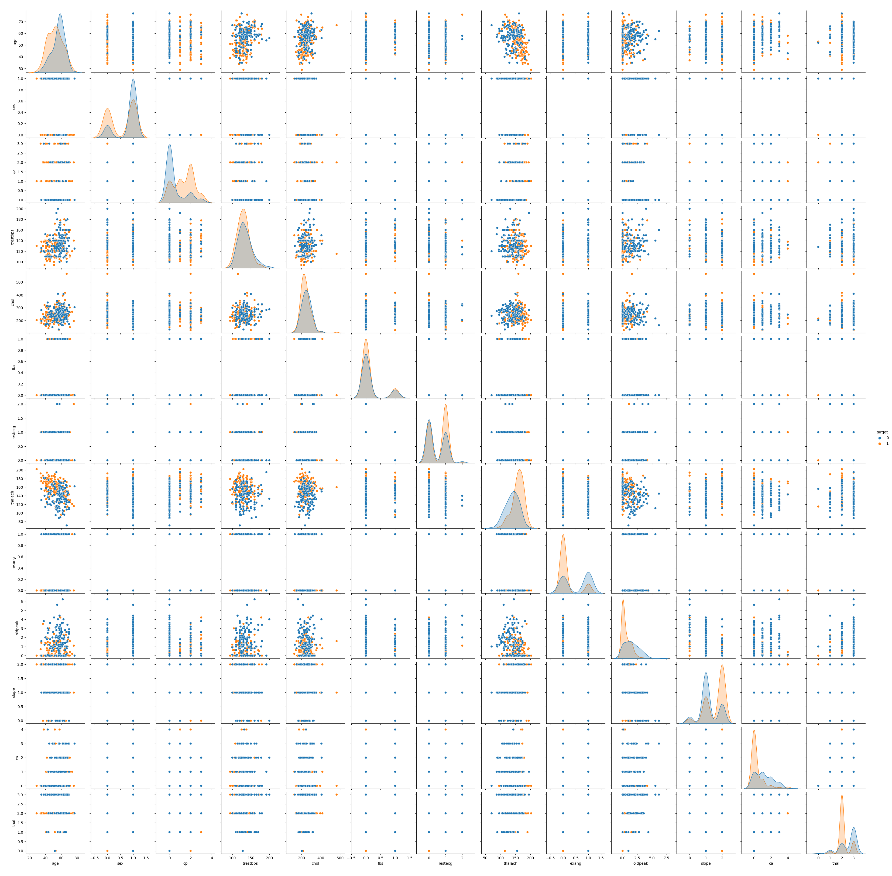

This code is an assignment for the GPH-GU 2338 Machine Learning in Public course. For more information about the dataset and background, please refer to our project report. 

Dataset Source: https://www.kaggle.com/ronitf/heart-disease-uci

## enviroment
Please have your rstudio prepared and have the following environment dependency packages ready:

```{r}
library("reticulate")
library(ISLR)
library(dplyr)
library(ggplot2)
library(gplots)
library(RColorBrewer)
library(gridExtra)
library(leaps)
library(tree)
library(randomForest)
library(gbm)
library(stats)
library(pROC)
library(xgboost)
library(boot)
library(MASS)
library(caret)
library(class)
library(grid)
library(neuralnet)
```

You can use `install.packages('XXX')` in r to install any missing packages. 


## ploting pairplot.png



Plotting pairplot.png will involve the seaborn package in python, and we provide two options to solve this problem. The first is to use `reticulate` in r to call the seaborn package directly, then save the plotted image and load it in the .rmd file. The pairplot drawn in this way may not be complete. We recommend the second approach, which is to use python directly to do the plotting. You can follow these command to draw this pairplot image.

```{shell}
conda create --name py_plot python=3.7
conda activate py_plot

## The following 2 commands serve the same function
## If you are in US, use this one:
pip install pandas matplotlib seaborn

## If you are in China, use this one to temporarily change the pip source to accelerate installation 
pip install pandas matplotlib seaborn -i https://mirrors.aliyun.com/pypi/simple/
```

```{python}

# Put heart.csv in the same folder that contains pair_plot.py.
python pair_plot.py
# It may take roughly 10s to draw the plot. pairplot.png will be generated.

```

Open the Heart_Disease_code.Rmd.rmd in rstudio and 'Knit to PDF' should now works fine.